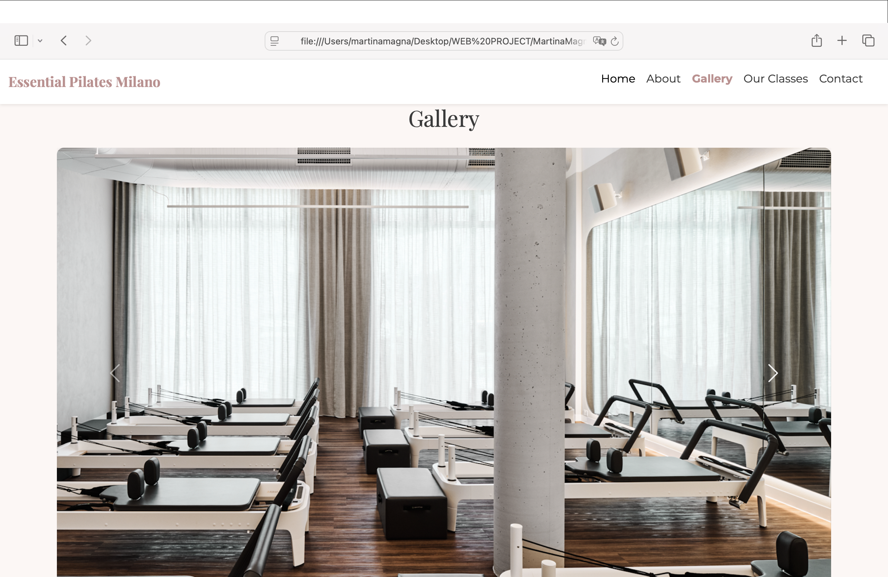

--- 
lang: en
---

# Essential Pilates Milano  
## Web Communication Project
### By Martina Magna 


---

## Project Idea

Essential Pilates Milano is a website designed for a modern Pilates studio.

The project aims to communicate a sense of wellbeing through mindful movement,
combining elegance, clarity, and a welcoming professional atmosphere.

---

### Target Audience

The website is addressed to adults interested in Pilates, wellness-oriented users and people seeking mindful movement and looking for a calm, high-quality studio experience.


---

## Project Goals

The main goals of the website are:

* Presenting the Pilates studio and its philosophy 
* Communicating a coherent brand identity 
* Encouraging users to book a free trial class 
* Offering a responsive and user-friendly experience 

---

## Technologies Used

The project was developed using:

* HTML5 for structure  
* CSS for styling and branding  
* Bootstrap 5 for layout and responsiveness  
* JavaScript for interactivity   
* Google Maps Embed for location  

---

## Website Structure

The website is structured into the following sections:

* Navigation bar with anchors  
* Hero section with call-to-action  
* About Us and Philosophy  
* Gallery with carousel  

--- 

## Website Structure (continued)


* Our Classes section  
* Contact form and map  
* Footer and cookie banner 


---

## Bootstrap Usage

Bootstrap was used to:

* Manage the grid system (rows and columns) 
* Create responsive cards for the “Our Classes” section  
* Implement the image carousel  
* Style the navigation bar and the form components  

---

## Bootstrap Example 

```html 
<div class="carousel-item"> 
   
</div> 
```


---

## Custom CSS

Custom CSS was added to:

* Define the color palette (blush pink and neutral tones) 
* Select and combine serif and sans-serif fonts  
* Create hover effects and transitions 
* Maintain visual coherence with the brand identity  

```css
.btn-outline-pink:hover {
  background-color: #c08f8f;
  color: white;
}
```

---

## JavaScript Features

JavaScript was used to add interactivity:

* Active navigation links while scrolling 
* Expandable class cards on click
* Cookie consent banner  

---

## JavaScript - Cookies
```js
document.getElementById("acceptCookies").addEventListener("click", function() {
  document.getElementById("cookieBanner").style.display = "none";
});
```
--- 

## JavaScript - Our Classes Section


---

## Lessons Learnt

During the development of the project I learned:

* How to build responsive layouts 
* How to integrate Bootstrap with custom CSS  
* How to manage basic JavaScript interactions  
* How to debug layout and script issues  
* How to organize a complete web project  

---

## Long-Term Development

Possible future developments include:

* Online booking system  
* User accounts and personal areas  
* Backend and database integration  
* SEO optimization  
* Accessibility improvements  

---

## Social Media Strategy

The studio could develop an online presence through:

* Instagram for classes, reels, and studio life 
* Facebook for events and community  
* YouTube for Pilates tutorials  
* TikTok for short wellness videos  
* Newsletter and WhatsApp updates  


---

## Why Reveal.js?

Reveal.js allowed me to:

* Create a web-based presentation
* Reuse web technologies (HTML, CSS, JS)
* Publish and share the presentation online
* Blur the line between presentation and website

---

## Conclusion

This project combines design, communication, and technical skills.

The website represents a solid starting point for a real Pilates studio and reflects the objectives of the Web Communication course.

---

### Thank you for your attention!
